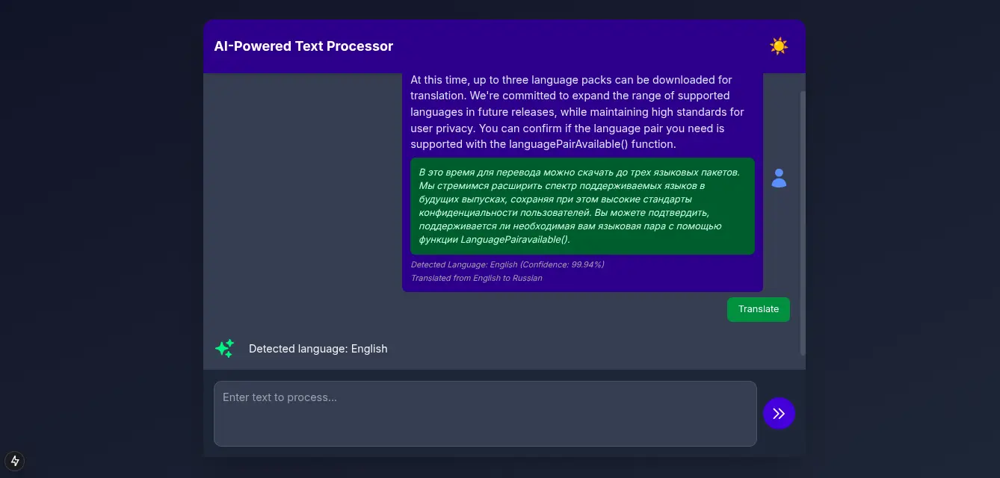

## Table of Contents

- [Task Requirements](#task-requirements)
  - [Core Features](#core-features)
  - [Acceptance Criteria](#acceptance-criteria)
  - [Technical Requirements](#technical-requirements)
- [Getting Started](#getting-started)

## Task Requirements

**Note**: **_You may need to turn on experimental feature flag in your_** **Chrome browser to access these native AI APIs**.

### Task - AI-Powered Text Processing Interface

Using HTML, CSS and Js/Ts, React or any React Framework(eg. Next etc), develop build and host an **AI-Powered Text Processing Interface** using Chrome's AI APIs. This application will allow users to input text and utilize features such as **summarization**, **translation**, and **language detection**. Users should be able to interact with a clean, responsive UI that ensures accessibility and provides meaningful feedback for
errors.

### Requirements

**Summary:**

- **The UI should look like a chat interface with a textarea field in the bottom of the page and the output field should be the the area above.**
- **When a user inputs a text and send, The text should Immediately render in the output area just like a normal chat window.**
- **Use the Language detector API to detect the text language and render it below the output text.**
- **Right below the text,**
- **Summarize: If the text is more than 150 characters, render a button below the text that reads "Summarize". Make use of the [Summarizer API](https://developer.chrome.com/docs/ai/summarizer-api) to achieve this.**
- **Translate: Render a simple select option field to switch between the languages listed below and a button that reads "Translate" to translate the output text to the selected language. Use the [Translator API](https://developer.chrome.com/docs/ai/translator-api).**
- **English**(`en`)
- **Portuguese** (`pt`)
- **Spanish** (`es`)
- **Russian** (`ru`)
- **Turkish** (`tr`)
- **French** (`fr`)
- Render the translated or(and) summarized output below the initial output text.

**NOTE: For summary, render the Summarize button only for output texts that are in English language.**

### Core Features

1. **Basic Layout:**

   - **Input Display:** Render a large, user-friendly textarea field for users to type or paste text and a send button that displays only a send icon.
   - **Language Selector:** Allow users to choose between languages listed above.
   - **Action Buttons:** Render two(2) action buttons(Summarize and Translate) to process the output text.
   - **Output Display:** Display the processed result (summary, translation, or detected language) in a styled output area.

2. **API Integration:**

   - Use the selected Chrome AI API to process the input text asynchronously.
   - Handle API responses and errors gracefully, ensuring users receive helpful feedback in case of issues.

3. **Accessibility:**

   - Ensure all interactive elements are keyboard-navigable and accessible with screen readers.
   - Provide meaningful ARIA labels and focus indicators for input fields and buttons.

4. **Responsive Design:**

   - Optimize the layout for different screen sizes, ensuring usability on desktop, tablet, and mobile devices.
   - Use a flexible grid or stacked layout to enhance the user experience on smaller screens.

**Acceptance Criteria**

1. **Functionality:**

   - Users can input text, send text and it renders in the output field.
   - Users should be able to summarize text outputs if the output text is more **than 150 characters**.
   - Users should be able to translate output texts to the different languages listed.
   - The app should successfully communicate with the Chrome AI APIs to retrieve accurate results.
   - Display processed results in the output area after API calls are complete.

2. **Error Handling**:

3. **Show an error message if**:

   - The API call fails.
   - The input text is empty or invalid.
   - Error messages should be clear.

4. **Responsive Design**:
   - The interface must adjust appropriately to various screen sizes, ensuring a smooth experience on mobile, tablet, and desktop devices.
5. **Code Quality**:
   - Use modular, readable code with proper comments and structure.
   - Implement async/await or Promises for API calls and error handling.

## Getting Started

This is a [Next.js](https://nextjs.org) project bootstrapped with [`create-next-app`](https://nextjs.org/docs/app/api-reference/cli/create-next-app).

First, run the development server:

```bash
npm run dev
# or
yarn dev
# or
pnpm dev
# or
bun dev
```

Open [http://localhost:3000](http://localhost:3000) with your browser to see the result.
